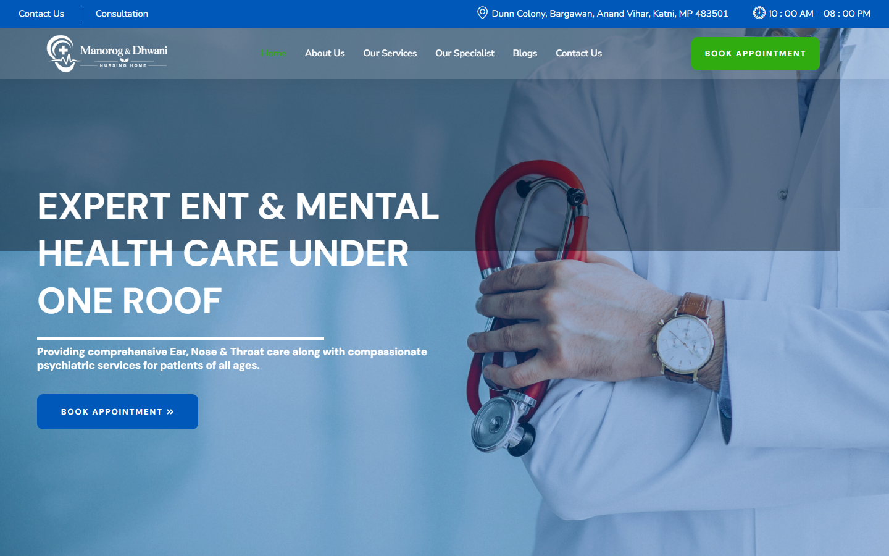

# Manorog & Dhwani Nursing Home

Production healthcare website case study for ENT and mental-health services.

## Overview

The website brings specialist healthcare information, doctor profiles and appointment-oriented journeys together in a responsive, patient-friendly experience.

## Product Experience

- Clear ENT and mental-health service discovery
- Responsive healthcare information architecture
- Doctor and specialist presentation
- Appointment-focused calls to action
- Contact, location and support journeys
- Trust-building visual content

## My Contribution

Selected professional work demonstrating responsive UI implementation, healthcare UX and business-focused front-end delivery.

## Live Website

[Visit Manorog & Dhwani](https://manorogdhwani.com/)

> Portfolio case study. Brand names and website content belong to their respective owners.
